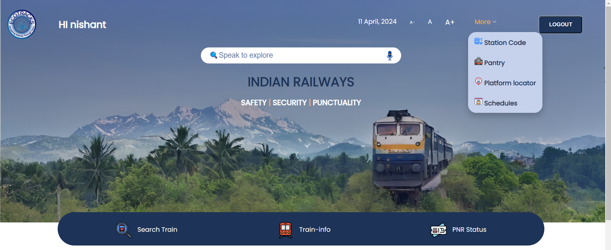
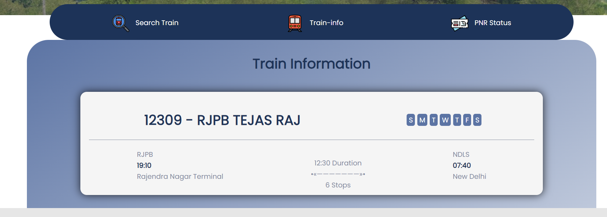
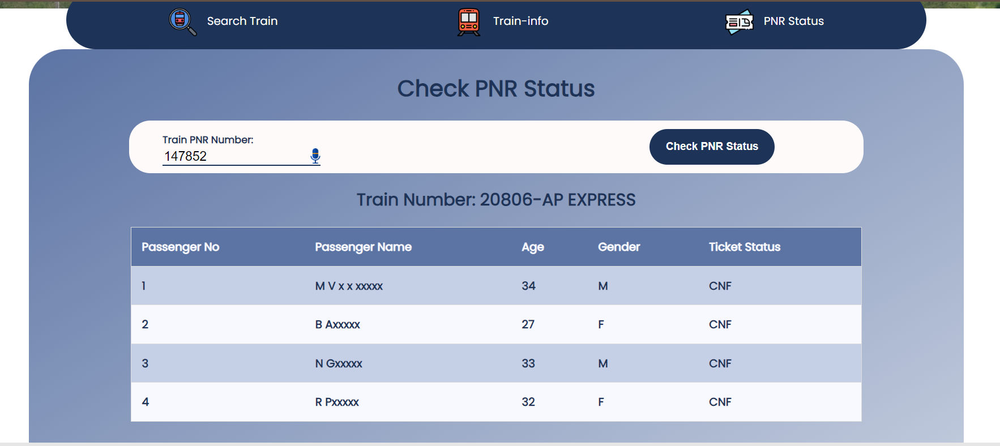
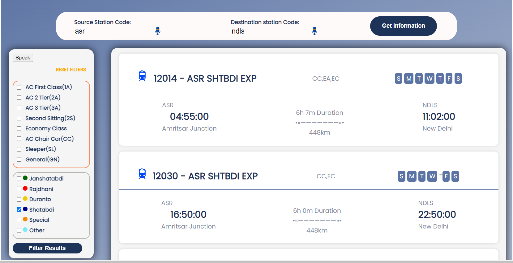

# 🚆 ECOTRACKS - Navigating Railways Through Voice

**ECOTRACKS** is a cutting-edge research project designed to **modernize traditional railway websites** by integrating **voice-based interaction**. Our platform transforms how users engage with railway inquiries, using **natural language** to streamline the process and provide real-time results.

---

## 🎯 Project Objective

> Traditional railway websites require users to manually search, filter, and input queries—a tedious experience for many.  
**ECO TRACKS** replaces this with **voice-driven interaction**, enabling effortless access to train data and bookings with just a spoken command.

---

## 🎥 Preview

### 🏠 Home Page


### 🚆 Main Page


### ℹ️ Train Info


### 🚄 PNR Status


### 🔍 Train Search


---

## 🧠 Tech Stack

| Technology | Usage |
|------------|--------|
| **HTML/CSS/JavaScript** | Frontend Interface & Dynamic Behaviors |
| **PHP & SQL** | Backend Logic & Database Interactions |
| **APIs** | Fetching Real-Time Train Information |
| **Web Speech API** | Voice Recognition & Speech Synthesis |

---

## ✨ Key Features
- 🔐 **Secure Login**: Each user login credentials are securely verified.
- 🎤 **Voice Interaction**: Speak your train queries—no more typing!  
- ⚡ **Real-Time Data**: Get updated train availability and schedules via APIs.  
- 🧭 **User-Centric Design**: A clean, modern UI that simplifies complex search processes.  
- 🧩 **Seamless API Integration**: Connected with live railway databases for real-time accuracy.  
- 💻 **Cross-Platform Compatible**: Use it on desktops, tablets, or mobile—anytime, anywhere.

---

## 🖥️ How It Works

1. **User speaks** into the microphone (e.g., "Show me trains from Delhi to Mumbai").
2. **Voice input is captured** via the Web Speech API and converted into a text query.
3. The system **fetches train data** via integrated railway APIs.
4. Results are **displayed on screen** and can also be **spoken aloud** using Text-to-Speech.

---

## 🚀 Getting Started

### 🔧 Installation

```bash
# Clone the repository
git clone https://github.com/your-username/ecotracks.git

# Navigate into the project folder
cd ecotracks

# Open index.html in your browser (local server recommended)
